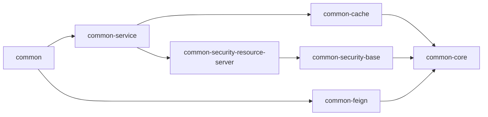

# 结构
- cache: 缓存相关
- codegenerator：代码生成
- core: 通用的对象、枚举、常量等
- feign：feign的通用配置
- security-resource-server：oauth2资源服务器的聚合模块，供资源微服务依赖
- service：资源微服务service模块的聚合模块

# TODO
* feign调用异常的处理
* feign调用会话的传输，从调用方把会话放入请求头，被调用方再从请求头中取出
    - 使用oauth2，把token放如feign请求头，oauth2资源服务器会去授权服务器查询用户信息，如果是jwt则直接在本地解析
    - jwt本地解析如何转化成BaseUser对象
    
# 依赖关系图

+ 各资源微服务的feign模块--》common-feign
+ 各资源微服务的service模块--》common-service